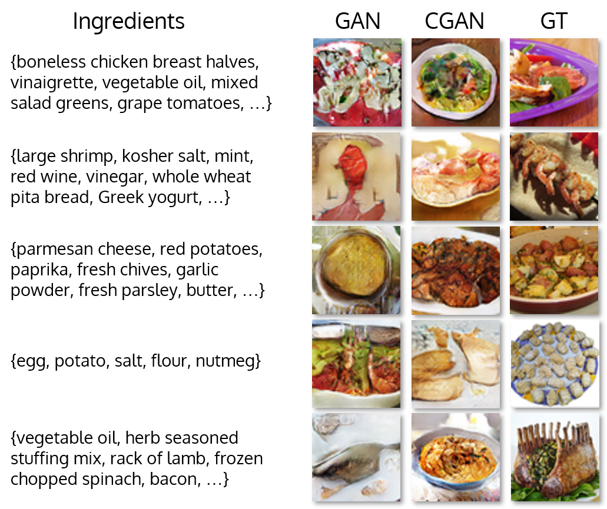
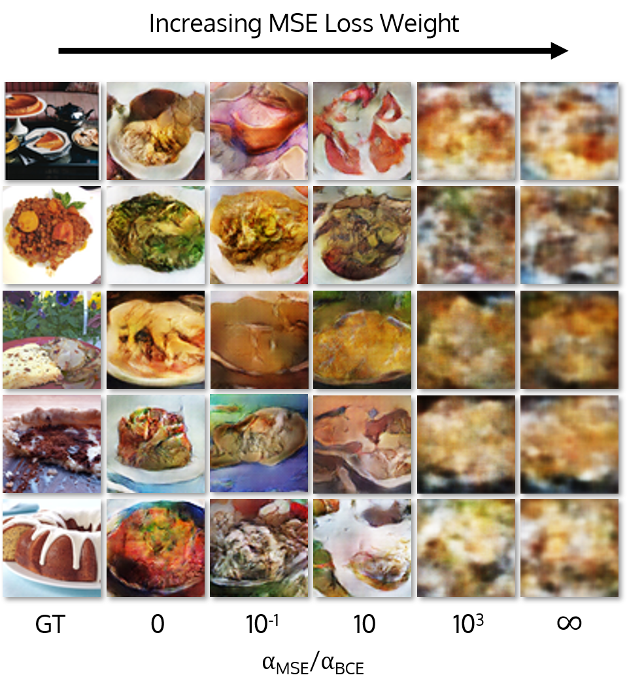
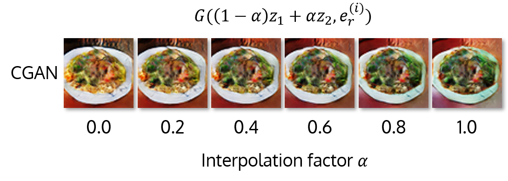
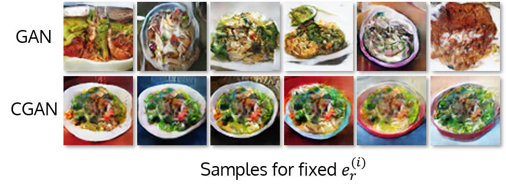

# GAN-stronomy: Generative Cooking with Conditional DCGANs
We trained conditional DCGANs to **generatively cook recipes** for our final project for Stanford's Deep Generative Models class (CS 236)!

<p align="center"></p>

### Setup

Our code is written in Python 3, and we used the Deep Learning VM (PyTorch) with an NVIDIA Tesla K80 GPU, 8 vCPUs, and 30 GB of RAM.

For the purposes of setup, we'll work in a directory called `project` (though this can really be named anything). After setup is complete, your directory structure should look something like this:

```
project
┣━ data
┣━ gan-stronomy
┃  ┣━ code
┃  ┣━ runs
┃  ┣━ scripts
┃  ┗━ temp
┗━ im2recipe-Pytorch
```

1. Clone the `gan-stronomy` repo, and install the requirements:

   ```
   >> cd [project]
   >> git clone https://github.com/ShinyCode/gan-stronomy
   >> pip install -r gan-stronomy/requirements.txt
   ```

2. Clone the `im2recipe` repo, copy our `gen_embeddings.py` script as follows, and install the requirements:

   ```
   >> git clone https://github.com/torralba-lab/im2recipe-Pytorch
   >> cp gan-stronomy/code/gen_embeddings.py im2recipe-Pytorch/
   >> pip install -r im2recipe-Pytorch/requirements.txt
   ```

   Since we're using Python 3 (and `im2recipe` uses Python 2), we call their code via a subprocess.

3. Create the `data` directory. Since it'll need a lot of space, you optionally can use our utility to mount a disk to that location (if desired):

   ```
   >> mkdir data
   >> ./gan-stronomy/scripts/mount_disk.sh
   ```

4. Create an account at [http://im2recipe.csail.mit.edu/dataset/login/](http://im2recipe.csail.mit.edu/dataset/login/) to download the Recipe1M dataset.

5. Download the following files to `project/data` . Due to time and memory constraints, we made splits within the original `im2recipe` validation set, but our code could be extended to use all three splits directly as provided.

   * `classes1M.pkl`
   * `det_ingrs.json` ("Ingredient detections")
   * `vocab.bin.gz`. You'll need to extract this to get `vocab.bin`.
   * `val.tar`. You'll need to extract this to get `val_lmdb` and `val_keys.pkl`.
   * `recipe1M_images_val.tar`. You'll need to extract this to a folder named `val_raw`.
   * `model_e500_v-8.950.pth.tar`. You can download the `im2recipe` pre-trained model [here](http://data.csail.mit.edu/im2recipe/model_e500_v-8.950.pth.tar).

6. Afterwards, the data folder should look like this:

   ```
   data
   ┣━ classes1M.pkl
   ┣━ det_ingrs.json
   ┣━ model_e500_v-8.950.pth.tar
   ┣━ val_lmdb
   ┃  ┣━ data.mdb
   ┃  ┗━ lock.mdb
   ┣━ val_raw
   ┃  ┣━ 0
   ┃  ┣━ ...
   ┃  ┗━ f
   ┣━ val_keys.pkl
   ┗━ vocab.bin
   ```

7. Finally, make the directory `project/gan-stronomy/temp`. This is where we'll store the GAN-stronomy dataset.

8. To actually generate the GAN-stronomy dataset, run `gen_dataset.py` from the `code` folder:

   ```
   >> cd project/gan-stronomy/code
   >> python3 gen_dataset.py [N] [OUT_PATH]
   ```

   For example, to generate a dataset of size 10,000, we could run:

   ```
   >> python3 gen_dataset.py 10000 ../temp/data10000
   ```

   This will likely give an error the first time around - the `im2recipe` repo has a few minor bugs which you'll need to iron out. If you get an out of memory error, then you'll likely need to change the batch size in their `args.py` to be smaller.

### Training

1. All the parameters associated with training are located in `project/gan-stronomy/code/opts.py`. The key ones you need to be concerned about are:

   * `LATENT_SIZE`: The dimension of the noise input to the generator.
   * `TVT_SPLIT`: The number of splits to make within the dataset. You can enter either integers or fractions. Training is always done on *split 0*.
   * `DATASET_NAME`: The name of the dataset created by `gen_dataset.py`.
   * `NUM_EPOCHS`: How many epochs to train for.
   * `CONDITIONAL`: Whether to condition on recipe embeddings. If this is set to `False`, then a warning will be displayed at the start of training.
   * `RUN_ID`: The ID of the run. Increment this after every run to avoid trampling old runs.
   * `INTV_PRINT_LOSS`: How often (in epochs) to print the loss
   * `INTV_SAVE_IMG`: How often (in epochs) to save an output image from the training and validation set.
   * `INTV_SAVE_MODEL`: How often (in epochs) to checkpoint the model.
   * `NUM_UPDATE_D`: How often to update the discriminator with respect to the generator.

2. Once `opts.py` is set to your satisfaction, just run the training script directly from the `code` folder:

   ```
   >> cd project/gan-stronomy/code
   >> python3 train.py
   ```

   The results will be saved in `project/gan-stronomy/runs/runID`, and a `opts.py`, `model.py`, and `train.py` will be copied so you remember what the run was for!

3. The script will courteously ring the system bell to alert the human when training is complete.

### Evaluation

In `project/gan-stronomy/code`, we've written an assortment of scripts to probe the performance and behavior of a trained model. In all cases, `[SPLIT_INDEX]` refers to the data split to use (*train* is $0$, *val* is $1$, *test* is $2$).

1. `test.py`: Runs the generator on a specified split of data, and outputs the generated images, corresponding ground truth images, and associated ingredient lists.

   ```
   >> python3 test.py [MODEL_PATH] [DATA_PATH] [SPLIT_INDEX] [OUT_PATH]
   ```

2. `sample.py`: Runs the generator on a fixed embedding but different samples of noise, and outputs the generated images.

   ```
   >> python3 sample.py [MODEL_PATH] [DATA_PATH] [SPLIT_INDEX] [OUT_PATH] [RECIPE_ID] [NUM_SAMPLES]
   ```

3. `interp.py`: Samples noise vectors $\mathbf{z}_1$ and $\mathbf{z}_2$ and runs the generator on a fixed embedding with noise input $(1 - \alpha)\mathbf{z}_1 + \alpha\mathbf{z}_2$ (for $\alpha \in [0, 1]$). Outputs the generated images.

   ```
   >> python3 interp.py [MODEL_PATH] [DATA_PATH] [SPLIT_INDEX] [OUT_PATH] [RECIPE_ID] [NUM_DIV]
   ```

4. `score.py`: For a given model, computes and outputs $\mathrm{FID}(S_T, S_V)$ and $\mathrm{FID}(S_T, S_V^{(M)})$, as described in the report. Splits $1$ and $2$ must be nonempty!

   ```
   >> python3 score.py [MODEL_PATH] [DATA_PATH]
   ```

### Gallery

**Generative Cooking**

Examples of generative cooking after training on $49,800$ examples from Recipe1M for $90$ epochs.

<p align="center"></p>

**Ablative Study of MSE Loss**

Using an MSE loss term in the generator had detrimental effects on output image quality, likely due to the one-to-many nature of the embedding-image mapping.

<p align="center"></p>

**Latent Space Interpolation**

Interpolating between generator noise inputs for a fixed embedding led to smooth blending between dishes.

<p align="center"></p>

**Effect of Conditioning**

Conditioning on recipe embeddings had a noticeable impact on the consistency of the generator outputs.

<p align="center"></p>
